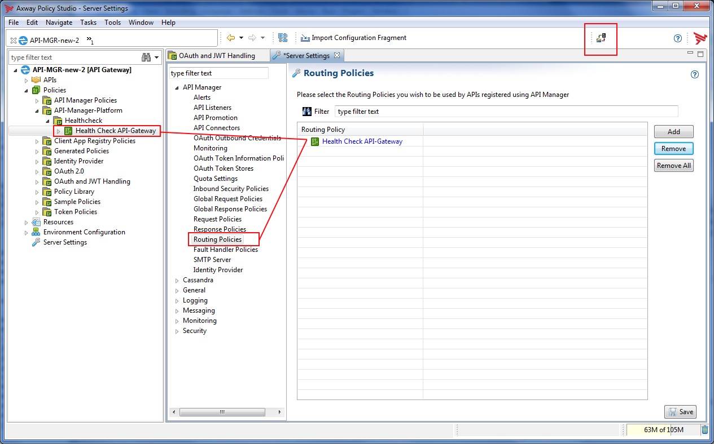
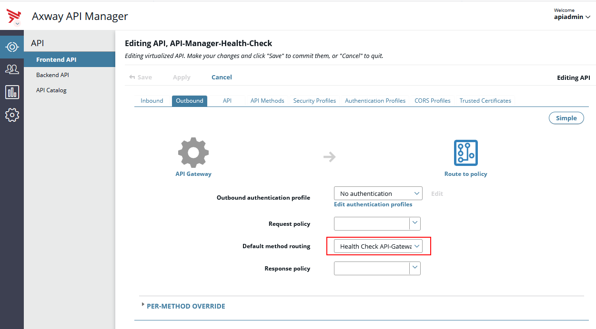
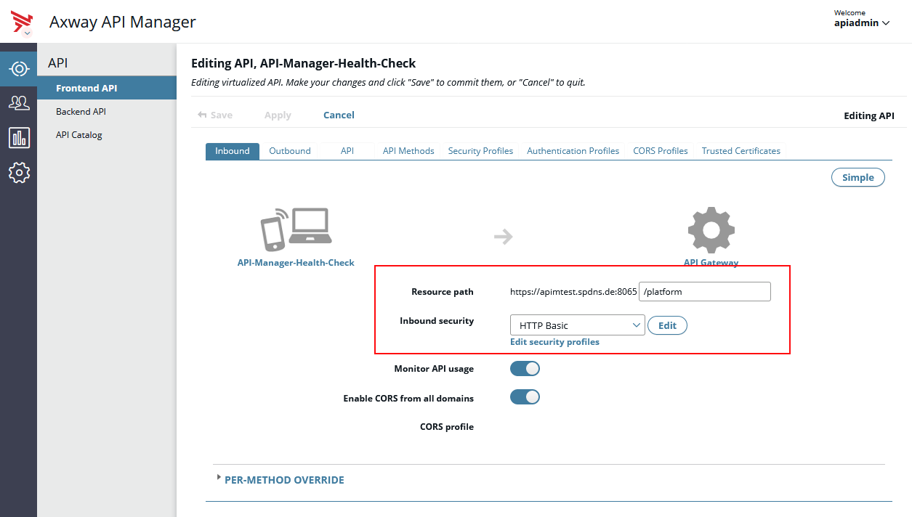
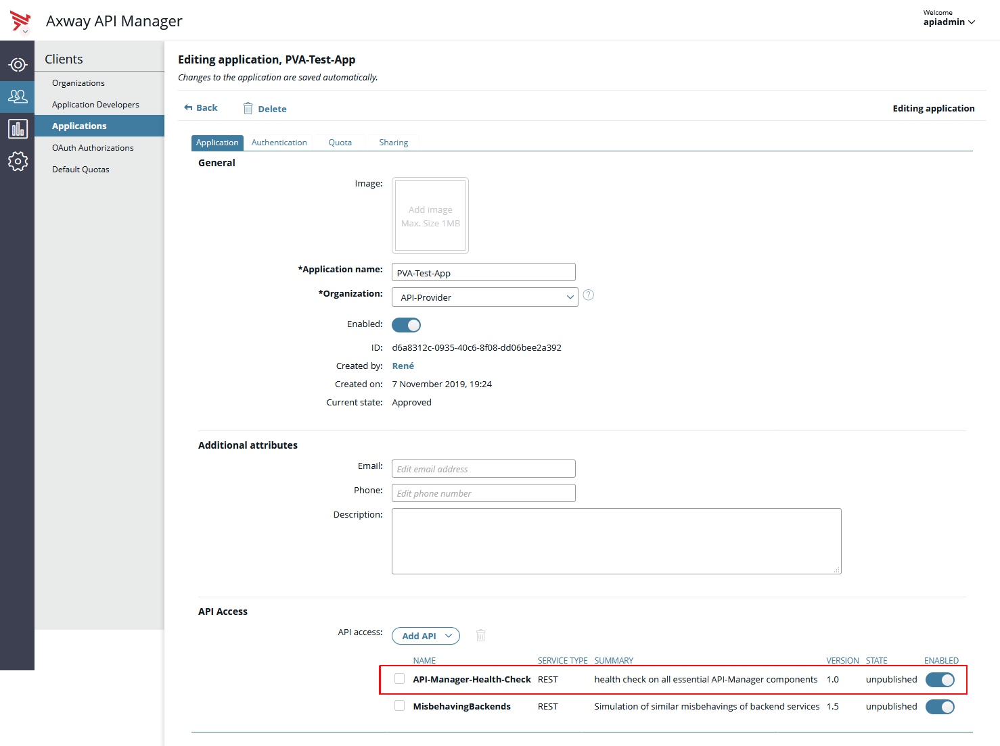
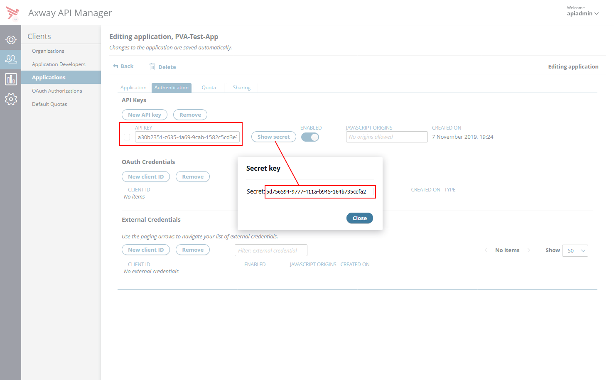

<!-- Markdown Reference: https://markdown.de/ or https://github.com/adam-p/markdown-here/wiki/Markdown-Cheatsheet -->

# Health Check for API-Manager (API-Gateway instances)

## Idea and solution

Using the "API-Manager Platform Healt-Check API" we inteded to get a better insight if the API-Gateway and the API-Manager ("application") on top if it are fully operational. In order to test this an API call itself might not be fully sufficient as API-Gateway is caching a lot of the configuration data stored within its Cassandra configuration database. Reading from KPS tabels within an API gateway therefore can be a simple cache lookup instead of the check of the cassandra infrastructure... But because we wanted to get early warnings if we already have lost a Cassandra node and now running with the bare minimum of config database nodes we created an extended check by just trying to establish a TCP connection to the pre-known Cassandra server nodes. The result is reflected back to the API caller.

In order to limit the amount of persons who can call the API we make use of the API-Manager capabilities for authentication of callers. In our case we had chosen HTTP Basic Auth as protection mechanism. So only users that can do an APP registration and a subscription on the health-check API are able to call the service. Usually this user group should be limited to infrasructure administrators!

Future enhancements:
Functionality could be extended towards real reads from a Cassandra database table later, just to ensure an Cassandra node is not only reachable on the network layer but is also fully functional.

## 1) Create and Configure Health Check Policy

The Axway API-Manager relies on the API-Gateway instance infrastructure. Several API-Gateways which belong to the same depoloyment group are the  infrastrutcture of one API-Manager (or API catalog). All configuration, user and usage data for API-Manager is kept in a Apache Cassanda cluster keyspace.

The API-Manager "application" on top of API-Gateway is using its datastore extensively. Because of this relationship a test for availablilty of API-Manager should not only call an API but also needs to verify if a majority of the needed Cassandra nodes is still visible to a API-Gateway so it could reconnect in case a chosen coordinator node might get down for any reason. 

In this sample test we assumed that any cassandra host is a seed host or at least a majority of all confiured seed nodes must be visible to an API-Gateway at runtime. Right now we assume exeactly 3 nodes to be configured within for each API-Gateway instance.

The idea is to allow any load-balancer or other monitoring tools to discover a current state of an individual API-Gateway that is part of an API-Manager group. The check allows to flag a API-Gateway of the API-Manager group to be unusable although it is still reachable for clients in case a needed component is no longer available.

A single API-Gateway will not necessarily show its inability to process API requests via API-Manager in case there is no suitable access to the Cassandra configuration database (keyspace). That's because of intense caching of configuration objects with API-Manager.
This check also considers the zero-downtime FED deployment in its state reply.

A successful call to this "Platform Health Check API" considers following components:
- API-Gateway (because the HTTP call is processed)
- API-Manager "application" is running and as properly loaded its configuration
- a majority of the configured Cassandra seed nodes is network wise visible to API-Gateway 

### Configuration and Setup

The Cassandra node IP's and port details of 3 seed hosts are expected to be provided as environment parameters via the API-Gateway local configuration file "envSettings.props". This was chosen because API-Gateway instances running within different data-center's (DC) might refer to differnt nodes of the Cassandra cluster - usually the ones that are located within the same DC. Using a FED deployment with environmentalized fields we cannot otherwise cater for those different settings depending on the location of an API-Gateway.

The Cassandra host for the APIhould-Gateways *should* be configured using these variables too. If an API-Gateway is not able to resolve the variables to an DNS name or IP the API-Gateway will not start properly and provide error messages within Trace-log!

Sample of enhancement of *envSettings.props*:
<pre><code>
...
/# Cassandra Hosts for local instance
env.CASSANDRA.SERVER.PORT=9042
env.CASSANDRA.SERVER1=sv236843.intranet.com
env.CASSANDRA.SERVER2=sv236843.intranet.com
env.CASSANDRA.SERVER3=sv236843.intranet.com
...
</pre></code>

**HINT:** In case of test environments that only use one single Cassandra instance, we can configure the same host as in the above sample! 

Configuration of Cassandra seed hosts with Server Settings should use the same:
Die Cassandra Seed Hosts sollten ebenfalls über die Environment-Variable gesetzt werden!
Beispiel:
Host: $ {env.CASSANDRA.SERVER1} , Posrt: $ {env.CASSANDRA.SERVER.PORT}
Host: $ {env.CASSANDRA.SERVER2} , Posrt: $ {env.CASSANDRA.SERVER.PORT}
Host: $ {env.CASSANDRA.SERVER3} , Posrt: $ {env.CASSANDRA.SERVER.PORT}

**Action:** Import the policy fragment from file *API-Mgr-Platform-HealthCheckAPI_RoutingPolicy.xml* into your current setup via Policy Studio and deploy. - Or add the policy as fragment deployment to the running configuration.

## 2) Adding Routing-Policy to API-Manager

Exposing the platform health check as an API via API-Manager needs a 'trick'. We register the policy to run as API-Manager Routing Policy. In this case we can overwrite the standard behaviour of API-Manager framework to route any API call to a backend-service. Instead, by running the policy we simulate a backend call and provide the current API-Manager system health state as response.

**Action:** Change Server settings using Policy Studio: add policy *Health Check API-Gateway* to Server Settings -> API-Manager -> Routing Policies + click Save and deploy!

## 3) Import API into API-Manager

After providing the simulated routing policy for use within the API-Manager framework we now need to import the API-Platform Health-Check API into API-Manager. At best this API should go into a special provider organisation. Doing so, only memebers of this organisation or API-Manager admins are able to create apps for using this API (adding subscriptions for own apps).

**Action:** As API-Manager admin go to Frontend API page and choose "New API" -> "Import API Collection". Find the exported api file  "API-Manager-HealthCkeck-API_plain.dat".

**Action:** After the API was imported an App with propper credentials are needed (API Key + Secret).
a) register an App
b) add the API (subscribe to API)
c) receive API-Key + Secret from API-Manager

## 4) Calling Platform Health-Check API

Samples for calling the *API-Manager Healt-Check API*:

<pre><code>
curl -vk \
 --header "Accept: application/xml" \
 --url https://apim.test.de:8065/platform/health \
 --user "a30b2351-c635-4a69-9cab-1582c5cd3e3a:5d756594-9777-411a-b945-164b735cefa8"

HTTP/1.1 200 OK
Date: Tue, 19 Nov 2019 16:40:21 GMT
Server:
Connection: close
X-CorrelationID: Id-f51ad45d9205737b2fc75231 0
Content-Type: application/xml

&lt;status>ok&lt;/status>  
</pre></code>

<pre><code>
curl -vk \
 --header "Accept: application/xml" \
 --url https://apim.test.de:8065/platform/health \
 --user "a30b2351-c635-4a69-9cab-1582c5cd3e3a:5d756594-9777-411a-b945-164b735cefa8"

HTTP/1.1 500 Internal Server Error
Date: Tue, 19 Nov 2019 16:08:17 GMT
Server:
Connection: close
X-CorrelationID: Id-7113d45d58034f3c99d51146 0
Content-Type: application/xml

&lt;status>error&lt;/status>
</pre></code>

or, in case JSON is more suitable than XML:
<pre><code>
curl -ik \
 --header "Accept: application/json" \
 --url https://apim.test.de:8065/platform/health \
 --user "a30b2351-c635-4a69-9cab-1582c5cd3e3a:5d756594-9777-411a-b945-164b735cefa8"

HTTP/1.1 200 OK
Date: Tue, 19 Nov 2019 16:39:18 GMT
Server:
Connection: close
X-CorrelationID: Id-b61ad45d7b0596a6bec38a7e 0
Content-Type: application/json

{ "status": "ok" }     
</pre></code>

### Sample Trace Log Content

Calling API-Manager using a client like the curl sample above will result in special log-messages with API-Gateway trace-log files. Samples are showing results on loglevel DEBUG for API-GW instance.

For single node Cassandra cluster the one node has been shut down:
<pre><code>
DEBUG	11/19/19, 17:08:17.290		Check for Cassandra Node accessibility
ERROR	11/19/19, 17:08:17.294		Health Check: Could not reach majority of Cassandra Nodes.
</pre></code>
...or...

After restarting of the single Cassandra node cluster the API-GW recovered from that access problem:
<pre><code>
DEBUG	11/19/19, 17:11:56.974		Check for Cassandra Node accessibility
DEBUG	11/19/19, 17:11:56.975		Cassandra Node A is reachable
DEBUG	11/19/19, 17:11:56.975		Cassandra Node B is reachable
DEBUG	11/19/19, 17:11:56.975		Cassandra Node C is reachable
DEBUG	11/19/19, 17:11:56.975		Health Check: OK - all Cassandra cluster nodes are reachable.
</pre></code>
